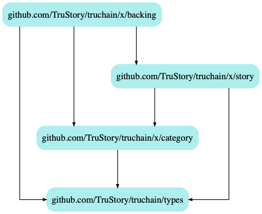

# TruChain: Backing Module

## Keeper

### Stores
* "backings"
    *  keys
        * `"backings:id:5"` -> `Backing`
        * `"stories:id:[StoryID]:backings:user:[AccAddress]"` -> `[BackingID]`
            * mapping of backers for each story

