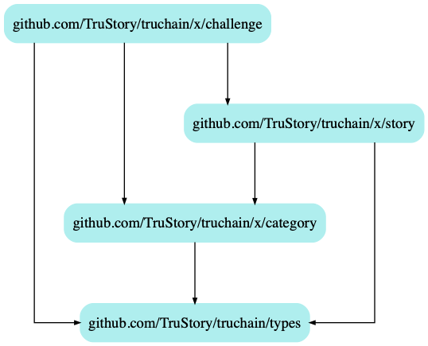

# TruChain: Challenge Module

## Keeper

### Dependencies
* story keeper

### Stores
* "challenges"
    *  keyspace
        * `"challenges:id:5"` -> `Challenge`
        * `"games:id:[GameID]:challenges:user:[AccAddress]"` -> `[ChallengeID]`

## Notes

