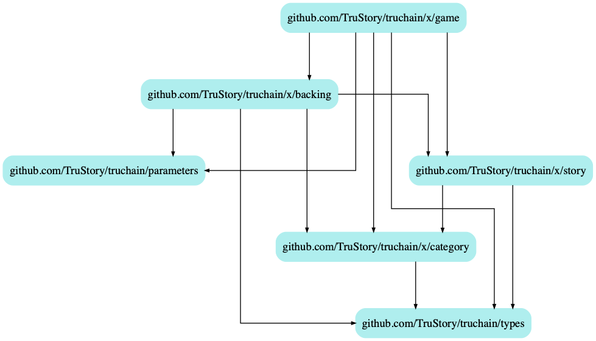

# TruChain: Game Module

## Keeper

Checks the story queue after each block to see if the quorum and challenge threshold have been met.
Changes state of story to voting if so.

## Notes

This module doesn't have a codec and doesn't handle any messages. It is only used internally by TruChain to manage the validation game.
