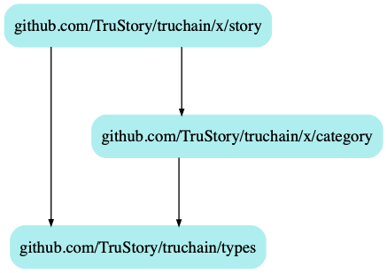

# TruChain: Story Module

## Keeper

### Dependencies
* category keeper

### Stores
* "stories"
    * keys
        * `"stories:id:[StoryID]"` -> `Story`
        * `"categories:id:[CategoryID]:stories:id:[StoryID]"` -> `[StoryID]`
        * `"categories:id:[CategoryID]:stories:challenged:id:[StoryID]"` -> `[StoryID]`

## Notes
