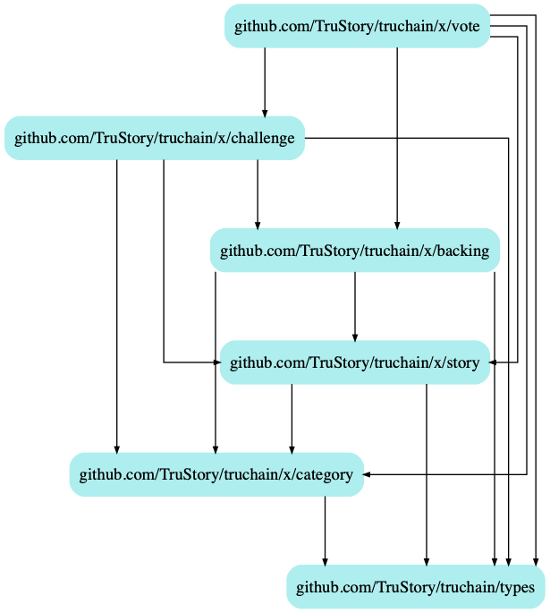

# TruChain: Vote Module

## Keeper

### Stores
* "votes"
    *  keyspace
        * `"votes:id:5"` -> `Vote`
            * main type storage
        * `"games:id:5:votes:user:[Address]"` -> `[VoteID]`
            * mapping of votes for each game

## Notes

